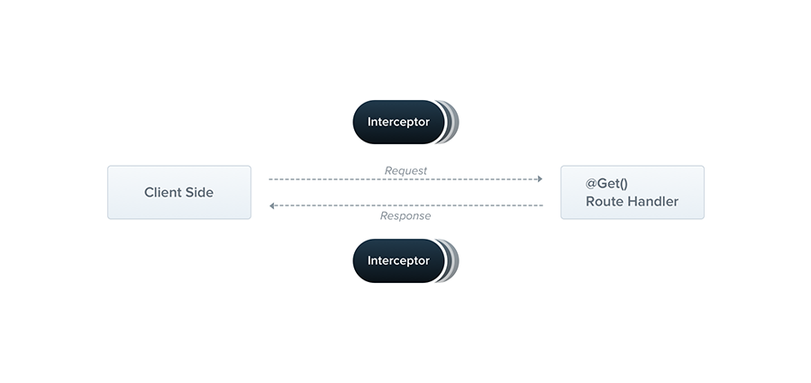

# Nest JS - overview: CRUD, Pipes, Interceptors and Guards

_ April 2022_

> 🔨 Nest JS - overview: CRUD, Pipes, Interceptors and Guards. From udemy: [Créer une app FullStack TypeScript avec Angular et NestJS](https://www.udemy.com/course/creer-une-app-fullstack-typescript-avec-angular-et-nestjs).

---

<p align="center">
  <a href="http://nestjs.com/" target="blank"></a>
</p>

[circleci-image]: https://img.shields.io/circleci/build/github/nestjs/nest/master?token=abc123def456
[circleci-url]: https://circleci.com/gh/nestjs/nest

## NESTJS: Architecture - core files

### main.ts

Entry point and server creation.

It uses the core function NestFactory to create a Nest application instance.

It includes an async function, which will bootstrap our application.

```ts
import { NestFactory } from '@nestjs/core';
import { AppModule } from './app.module';

async function bootstrap() {
  const app = await NestFactory.create(AppModule);
  await app.listen(3000);
}
bootstrap();
```

### app.module.ts

The root module of the application.

It encapsulates a controller and a service (provider).

```ts
import { Module } from '@nestjs/common';
import { AppController } from './app.controller';
import { AppService } from './app.service';

@Module({
  imports: [],
  controllers: [AppController],
  providers: [AppService],
})
export class AppModule {}
```

### app.controller.ts

A basic controller with a single route.

This one add the decorator @Controller (that is a new feature for the class) and a new method get using the decorator @Get. In the constructor we add a service using dependancy injection.

Note : single-responsibility principle (SRP) => a controller only does one task

```ts
import { Controller, Get } from '@nestjs/common';
import { AppService } from './app.service';

@Controller()
export class AppController {
  constructor(private readonly appService: AppService) {}

  @Get()
  getHello(): string {
    return this.appService.getHello();
  }
}
```

### app.service.ts

A basic service with a single method.

We transform the class into a service using @injectable.

The core file add a method returning "Hello World!".

```ts
import { Injectable } from '@nestjs/common';

@Injectable()
export class AppService {
  getHello(): string {
    return 'Hello World!';
  }
}
```

## NEST JS: Concepts

### Nest generate (scaffolding)

Generates and/or modifies files based on a schematic: [nest generate](https://docs.nestjs.com/cli/usages#nest-generate).

### Decorators

A decorator is an expression that returns a function. It can take a target, name and property descriptor as arguments. We apply a decorator with an @ character and place it at the top of what we are trying to decorate.

We can define decorators for class, method or a property.

NestJS provides a set of param decorators. We can use them with HTTP route handlers. Some of the common decorators are @Request() or @Req(), @Response() or @Res(), @Body(), @Query() and so on.

Additionally, you can create your own custom decorators.

`nest generate decorator <mydecorator>`

`nest g d <mydecorator>`

=> CREATE src/<mydecorator>.decorator.ts

### Modules

A module is a class annotated with a @Module() decorator. The @Module() decorator provides metadata that Nest makes use of to organize the application structure.


`nest generate module <mymodule>`

`nest g mo <mymodule>`

=> CREATE src/todo/<mymodule>.module.ts

=> UPDATE src/app.module.ts

Ex:

```ts
import { Module } from '@nestjs/common';

@Module({})
export class TodoModule {}
```

Generate a module declaration.

### Controllers

Controllers are responsible for handling incoming requests and returning responses to the client.


`nest generate controller <mycontroller>`

`nest g co <mycontroller>`

Generate a controller declaration, including its associated module and spec (test file).

=> CREATE src/<mymodule>/<mycomponent>.controller.spec.ts

=> CREATE src/<mymodule>/<mycomponent>.controller.ts

=> UPDATE src/<mymodule>/<mycomponent>.module.ts

Ex _<mycomponent>.controller.ts_:

```ts
import { Controller } from '@nestjs/common';

@Controller('todo')
export class TodoController {}
```

Ex _<mycomponent>.module.ts_:

```ts
import { Module } from '@nestjs/common';
import { TodoController } from './todo.controller';

@Module({
  controllers: [TodoController],
})
export class TodoModule {}
```

### Providers / Services

Providers are a fundamental concept in Nest. Many of the basic Nest classes may be treated as a provider – services, repositories, factories, helpers, and so on. The main idea of a provider is that it can be injected as a dependency; this means objects can create various relationships with each other, and the function of "wiring up" instances of objects can largely be delegated to the Nest runtime system.


`nest generate service <myservice>`

`nest g s <myservice>`

Generate a service declaration.

=> CREATE src/<mymodule>/<myservice>.service.spec.ts

=> CREATE src/<mymodule>/<myservice>.service.ts

=> UPDATE src/<mymodule>/<myservice>.module.ts

Ex:

```ts
import { Injectable } from '@nestjs/common';

@Injectable()
export class TodoService {}
```

### Interfaces

Interface is a structure that defines the contract in your application. It defines the syntax for classes to follow. Classes that are derived from an interface must follow the structure provided by their interface.

TypeScript interfaces are used for type-checking and defining the types of data that can be passed to a controller or a Nest service.

The TypeScript compiler does not convert interface to JavaScript. It uses interface for type checking. This is also known as "duck typing" or "structural subtyping".

`nest generate interface <myinterface>`

Generate an interface.

Ex:

```ts
export interface Todo {
  id: number;
  title: string;
  done: boolean;
  description?: string;
}
```

### Data Transfer Object (DTO)

DTO is the short name of Data Transfer Object. DTO is used in order to validate incoming requests.

We could determine the DTO schema by using TypeScript interfaces, or by simple classes. Interestingly, we recommend using classes here. Why? Classes are part of the JavaScript ES6 standard, and therefore they are preserved as real entities in the compiled JavaScript. On the other hand, since TypeScript interfaces are removed during the transpilation, Nest can't refer to them at runtime. This is important because features such as Pipes enable additional possibilities when they have access to the metatype of the variable at runtime.

```ts
export class CreateTodoDto {
  readonly id: number;
  readonly title: string;
  readonly done: boolean;
  readonly description?: string;
}
```

### Pipes ~


A pipe is a class annotated with the @Injectable() decorator, which implements the PipeTransform interface.

Pipes have two typical use cases:

- transformation: transform input data to the desired form (e.g., from string to integer)
- validation: evaluate input data and if valid, simply pass it through unchanged; otherwise, throw an exception when the data is incorrect

Pipes are only used for validation or object transformation and as such immediately return successes (with the possibly transformed object) or throw errors about why the transformation/validation failed.

They can only be used during Request process.

`nest g pi <mypipe>`

ex:

=> nest g pi common/upper

CREATE src/common/<mypipe>.pipe.spec.ts

CREATE src/common/<mypipe>.pipe.ts

```ts
import { ArgumentMetadata, Injectable, PipeTransform } from '@nestjs/common';

@Injectable()
export class ExemplePipe implements PipeTransform {
  transform(value: any, metadata: ArgumentMetadata) {
    return value;
  }
}
```

### Interceptors



An interceptor is a class annotated with the @Injectable() decorator, which implements the NestInterceptor interface.

There are several uses as below:

- Bind extra logic before or after a method’s execution
- Transform the result from a method.
- Transform any exceptions thrown from a function.
- Extend a method’s behaviour with extra logic.
- Override a function based on some condition.

`nest generate interceptor common/<myinterceptor>`

`nest g int common/<myinterceptor>`

=> CREATE src/common/<myinterceptor>.spec.ts

=> CREATE src/common/<myinterceptor>.interceptor.ts

```ts
import {
  CallHandler,
  ExecutionContext,
  Injectable,
  NestInterceptor,
} from '@nestjs/common';
import { Observable } from 'rxjs';

@Injectable()
export class ExempleInterceptor implements NestInterceptor {
  intercept(context: ExecutionContext, next: CallHandler): Observable<any> {
    return next.handle();
  }
}
```

The difference with the pipe is that the can be positioned both at the level of the request (intercepting request using context) and the response (using the callback method nexthandle() that leave the request continue untill the controller then use a pipe an operator from rxjs, for instance tap to logging the value from the response).

Reminder: an observable is a stream that continuously sends data that can be intercepted at any time.

```ts
import {
  CallHandler,
  ExecutionContext,
  Injectable,
  NestInterceptor,
} from '@nestjs/common';
import { Observable } from 'rxjs';
import { tap } from 'rxjs/operators';

@Injectable()
export class ExempleInterceptor implements NestInterceptor {
  intercept(context: ExecutionContext, next: CallHandler): Observable<any> {
    // during request
    console.log('intercepting request', context);
    return (
      next
        // during response
        .handle()
        .pipe(
          tap((valueFromRouteHandler) =>
            console.log('after controller sending response'),
          ),
        )
    );
  }
}
```

### Guards


A guard is a class annotated with the @Injectable() decorator, which implements the CanActivate interface.

Guards have a single responsibility. They determine whether a given request will be handled by the route handler or not, depending on certain conditions (like permissions, roles, ACLs, etc.) present at run-time.

Guards are executed after each middleware, but before any interceptor or pipe.

`nest generate guard common/<myguard>`

`nest g gu common/<myguard>`

=> CREATE src/common/<myguard>.guard.spec.ts

=> CREATE src/common/<myguard>.guard.ts

```ts
import { CanActivate, ExecutionContext, Injectable } from '@nestjs/common';
import { Observable } from 'rxjs';

@Injectable()
export class ExempleGuard implements CanActivate {
  canActivate(
    context: ExecutionContext,
  ): boolean | Promise<boolean> | Observable<boolean> {
    return true;
  }
}
```

## Test this application

### Installation

```bash
npm install
```

### Running the app

```bash
# development
npm run start

# watch mode
npm run start:dev

# production mode
npm run start:prod
```

[http://localhost:3000/](http://localhost:3000/)

### 01-CRUD: todo

[http://localhost:3000/todo](http://localhost:3000/todo)

**Module:** _src/01-todo_

- _todo.controller.ts_
- _todo.module.ts_
- _todo.service.ts_
- _src/todo/dto/create-todo.dto.ts_
- _src/todo/interfaces/todo.interface.ts_

#### Get

```bash
curl http://localhost:3000/todo

curl http://localhost:3000/todo/2
```

Or:

[http://localhost:3000/todo](http://localhost:3000/todo)

#### Post

```bash
curl -X POST http://localhost:3000/todo -H 'Content-Type: application/json' -H 'Accept: application/json' -d '{"id":4, "title":"test-title", "description":"test-description", "done":false}'
```

#### Patch

```bash
curl -X PATCH http://localhost:3000/todo/2 -H 'Content-Type: application/json' -H 'Accept: application/json' -d '{"title": "new_value", "description":"new_value", "done":true}'
```

#### Delete

```batch
curl -X DELETE http://localhost:3000/todo/2
```

### 02-Pipes

**Module:** _src/02-pipes_

#### Get (to uppercase)

_src/common/pipes/upper.pipe.ts_

```bash
curl http://localhost:3000/pipes/vincent
```

[http://localhost:3000/pipes/vincent](http://localhost:3000/pipes/vincent)

Output: Hello VINCENT

#### Post (to uppercase using object)

_src/common/pipes/upper-object.pipe.ts_

```bash
curl -X POST http://localhost:3000/pipes -H 'Content-Type: application/json' -H 'Accept: application/json' -d '{"author":"Vincent", "content":"Hello world"}'
```

Output: {"author":"VINCENT","content":"HELLO WORLD"}

#### Get:article (casting type string to number)

_src/common/pipes/parse-int.pipe.ts_

```bash
curl http://localhost:3000/pipes/articles/1
```

[http://localhost:3000/pipes/articles/1](http://localhost:3000/pipes/articles/1)

Output value without pipe: {"id":"1","idType":"string"}

Output value with pipe: {"id":1,"idType":"number"}

#### Slug

_src/common/pipes/slug.pipe.ts_

```bash
curl -X POST http://localhost:3000/pipes/articles -H 'Content-Type: application/json' -H 'Accept: application/json' -d '{"title":"Javascript ou Frameworks? éèëê", "content": "Lorem ipsum", "Author": "Vincent"}'
```

Output: {"title":"Javascript ou Frameworks? éèëê","content":"Lorem ipsum","Author":"Vincent","slug":"javascript-ou-frameworks?-eeee"}

### 03-Interceptors

**Module:** _src/03-interceptors_

#### Request duration

_src/common/interceptors/mesure-duration.interceptor.ts_

Open [http://localhost:3000/interceptors](http://localhost:3000/interceptors)

Output: Duration in ms xx

#### Request log clients

_src/common/interceptors/log-clients.interceptor.ts_

Open [http://localhost:3000/interceptors](http://localhost:3000/interceptors)

Output (exemple):

```batch
Client:  {
  date: '2022-04-14T14:05:35.968Z',
  urlRequest: 'GET /interceptors',
  ipAdress: undefined,
  navigator: 'Mozilla/5.0 (Windows NT 10.0; Win64; x64) AppleWebKit/537.36 (KHTML, like Gecko) Chrome/100.0.4896.88 Safari/537.36'
}
```

#### Enrich http response

_src/common/interceptors/enrich-response.interceptor.ts_

Open [http://localhost:3000/interceptors](http://localhost:3000/interceptors)

Output:

```json
{
  "initialContent": "Hello Interceptor module!",
  "editedContent": "HELLO INTERCEPTOR MODULE!",
  "length": 25
}
```

#### Enrich http response - part 2

_src/common/interceptors/enrich-response-part2.interceptor.ts_

Open [http://localhost:3000/interceptors/hello/vincent](http://localhost:3000/interceptors/hello/vincent)

Output:

```json
{
  "initialContent": "Hello vincent",
  "editedContent": "HELLO VINCENT",
  "length": 13,
  "result": {
    "headers": {
      "host": "localhost:3000",
      "connection": "keep-alive",
      "sec-ch-ua": "\" Not A;Brand\";v=\"99\", \"Chromium\";v=\"100\", \"Google Chrome\";v=\"100\"",
      "sec-ch-ua-mobile": "?0",
      "sec-ch-ua-platform": "\"Windows\"",
      "dnt": "1",
      "upgrade-insecure-requests": "1",
      "user-agent": "Mozilla/5.0 (Windows NT 10.0; Win64; x64) AppleWebKit/537.36 (KHTML, like Gecko) Chrome/100.0.4896.88 Safari/537.36",
      "accept": "text/html,application/xhtml+xml,application/xml;q=0.9,image/avif,image/webp,image/apng,*/*;q=0.8,application/signed-exchange;v=b3;q=0.9",
      "sec-fetch-site": "none",
      "sec-fetch-mode": "navigate",
      "sec-fetch-user": "?1",
      "sec-fetch-dest": "document",
      "accept-encoding": "gzip, deflate, br",
      "accept-language": "fr-FR,fr;q=0.9,en-US;q=0.8,en;q=0.7",
      "cookie": "hubspotutk=845085f9f2df0a9a7c6275d4d2629c01; _hjSessionUser_2008156=eyJpZCI6Ijg1YjZiMWE2LTU0OTItNTQ3My1iM2M2LWI0ZTM3MmE4ZjZiMSIsImNyZWF0ZWQiOjE2NDM4MDY5MjA0NTAsImV4aXN0aW5nIjp0cnVlfQ==; __hstc=181257784.845085f9f2df0a9a7c6275d4d2629c01.1643826158326.1643826158326.1643870679749.2; pma_lang=fr",
      "if-none-match": "W/\"5c3-kDBaIjw0lhA4PKh5e6cUBW36OLc\""
    },
    "dateLogged": "2022-04-19T09:15:04.594Z",
    "timeZoneOffset": "-2 hours"
  }
}
```

#### Filter and replace

_src/common/interceptors/filter-request.interceptor.ts_

Open [http://localhost:3000/interceptors/filter/vincent](http://localhost:3000/interceptors/filter/vincent)

Output:

```html
Hello vincent
```

Open [http://localhost:3000/interceptors/filter/frack](http://localhost:3000/interceptors/filter/frack)

Output:

```html
Word forbidden!
```

### 04-Guards

**Module:** _src/04-guards_

#### Post (vehicle)

_src/common/guards/ecolo.guard.ts_

_src/common/decorators/green-vehicles.decorator.ts_

````bash
curl -X POST http://localhost:3000/guards/destination -H "Content-Type: application/x-www-form-urlencoded" -d- [Nest JS - overview: CRUD, Pipes, Interceptors and Guards]

Output: Have a good trip with your bike

​```bash
curl -X POST http://localhost:3000/guards/destination -H "Content-Type: application/x-www-form-urlencoded" -d "vehicle=plane"
````

Output: {"statusCode":403,"message":"Forbidden resource","error":"Forbidden"}

Nest provides the ability to attach custom metadata to route handlers through the **@SetMetadata()** decorator. This metadata supplies our missing role data, which a smart guard needs to make decisions.

To access the route's role(s) (custom metadata), we'll use the **Reflector** helper class.

To read the handler metadata, use the get() method.

```ts
const greenVehicles = this.reflector.get<string[]>(
  'greenVehicles',
  context.getHandler(),
);
```

Here we use a **custom decorator**, _src/common/decorators/green-vehicles.decorator.ts_, in which we import **SetMetadata**.

```ts
import { SetMetadata } from '@nestjs/common';

export const GreenVehicles = (...args: string[]) =>
  SetMetadata('greenVehicles', args);
```

## VSCode : Avoid error _Parsing error: Cannot read file '…/tsconfig.json'.eslint_

Create a .vscode folder in the root project directory and add the following property to the settings.json file inside it:

```ts
{
  "eslint.workingDirectories": [
    "src"
  ]
}
```

In _.eslintrc.js_:

```js
  parserOptions: {
    project: 'PROJECT_NAME/tsconfig.json',
    sourceType: 'module',
  },
```

## Useful links

- [NestJS: Pipes](https://docs.nestjs.com/pipes)
- [NestJS: CLI command reference](https://docs.nestjs.com/cli/usages)
- [Run Curl Commands Online](https://reqbin.com/curl)
- [Implementing a Generic Repository Pattern Using NestJS](https://betterprogramming.pub/implementing-a-generic-repository-pattern-using-nestjs-fb4db1b61cce)
- [Clean Node.js Architecture —With NestJs and TypeScript](https://betterprogramming.pub/clean-node-js-architecture-with-nestjs-and-typescript-34b9398d790f)
- [getting started with Nest (NestJS) framework](https://tkssharma.com/getting-started-with-nest-js-framework-for-nodejs-apis/)
- [NestJS : l'architecture Angular au service de vos applications NodeJS](https://blog.ippon.fr/2019/07/15/nestjs-larchitecture-angular-au-service-des-applications-nodejs/)
- [NestJS : Interceptors](https://docs.nestjs.com/interceptors)
- [NestJS : Guards](https://docs.nestjs.com/guards)

## License

Nest is [MIT licensed](LICENSE).
